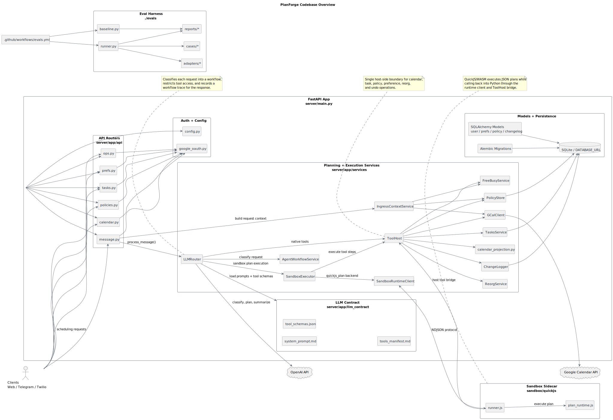

# PlanForge

PlanForge is an agentic scheduling backend that converts natural-language planning requests into structured, auditable actions across calendars, tasks, preferences, and durable scheduling policies.

## What It Does

- Classifies incoming requests into explicit planning workflows before acting.
- Orchestrates LLM-guided tool use for calendar updates, task management, policy storage, and undoable changes.
- Runs model-authored plans through a shared execution boundary backed by a QuickJS/WASM sandbox path.
- Tracks behavior with a built-in eval harness, regression baselines, and CI checks.

## Architecture

- `message.py` is the conversational entrypoint and the main path for agent-driven planning requests.
- `LLMRouter` handles workflow-aware orchestration, prompt usage, tool access, and response tracing.
- `ToolHost` is the central execution boundary for calendar, task, preference, policy, reorg, and undo operations.
- `sandbox/quickjs` contains the constrained runtime used for sandboxed plan execution.
- `evals/` contains deterministic and live evaluation suites, baseline comparison, and reporting.

## Design

- Planning is separated cleanly from side effects.
- Tool execution is centralized behind one host boundary.
- Calendar state, task state, policies, and undo history all fit into the same workflow model.

## Architecture

Diagram source: [assets/planforge-architecture.puml](/assets/planforge-architecture.puml)
